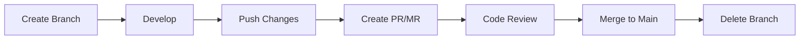

# 🌿 Git Branch Naming Guidelines

> **Single Source of Truth for Branch Management**  
> _A comprehensive guide for consistent and clean git branching_

---

## 🎯 Quick Start Checklist

✅ **Use lowercase letters only**  
✅ **Separate words with hyphens (`-`)**  
✅ **Include category prefix**  
✅ **Keep names under 50 characters**  
✅ **Be descriptive but concise**

---

## 📋 Standard Branch Categories

### 🔥 **Primary Categories**

| Category         | Prefix     | Purpose                           | Example                         |
| ---------------- | ---------- | --------------------------------- | ------------------------------- |
| **New Features** | `feature/` | New functionality or enhancements | `feature/user-authentication`   |
| **Bug Fixes**    | `bugfix/`  | General bug fixes                 | `bugfix/login-validation-error` |
| **Hot Fixes**    | `hotfix/`  | Critical production fixes         | `hotfix/payment-gateway-down`   |
| **Releases**     | `release/` | Preparing release versions        | `release/v2.1.0`                |

### 🔧 **Secondary Categories**

| Category          | Prefix   | Purpose                     | Example                            |
| ----------------- | -------- | --------------------------- | ---------------------------------- |
| **Documentation** | `docs/`  | Documentation updates       | `docs/api-reference-update`        |
| **Testing**       | `test/`  | Adding or updating tests    | `test/user-service-unit-tests`     |
| **Maintenance**   | `chore/` | Dependency updates, cleanup | `chore/update-webpack-config`      |
| **Performance**   | `perf/`  | Performance optimizations   | `perf/database-query-optimization` |

### 🧪 **Experimental Categories**

| Category        | Prefix        | Purpose            | Example                              |
| --------------- | ------------- | ------------------ | ------------------------------------ |
| **Experiments** | `experiment/` | Proof of concepts  | `experiment/new-caching-strategy`    |
| **Refactoring** | `refactor/`   | Code restructuring | `refactor/user-service-architecture` |

---

## ✅ **Naming Best Practices**

### **✨ Good Examples**

```bash
feature/add-payment-integration
bugfix/resolve-memory-leak
hotfix/critical-security-patch
docs/setup-installation-guide
test/checkout-flow-e2e
chore/upgrade-node-dependencies
```

### **❌ Bad Examples**

```bash
Feature/Add_Payment_Integration  # Mixed case, underscores
fix bug                          # Spaces, not descriptive
hotfix/fix                       # Too vague
my-awesome-feature-that-does-everything-perfectly  # Too long
```

---

## 🚫 **Characters to Avoid**

| ❌ **Don't Use**     | ✅ **Use Instead** | **Reason**               |
| -------------------- | ------------------ | ------------------------ |
| Spaces ` `           | Hyphens `-`        | Git doesn't allow spaces |
| Underscores `_`      | Hyphens `-`        | Industry standard        |
| UPPERCASE            | lowercase          | Better readability       |
| Special chars `@#$%` | Letters/numbers    | Can break git tools      |
| `..` (double dots)   | Single words       | Reserved in git          |

---

## 🔄 **Advanced Patterns**

### **With Ticket Numbers**

```bash
feature/JIRA-123-user-dashboard
bugfix/GH-456-mobile-responsive
hotfix/TICKET-789-api-timeout
```

### **Team Ownership**

```bash
frontend/feature/checkout-redesign
backend/bugfix/database-connection
mobile/feature/push-notifications
```

### **Personal Branches**

```bash
john/experiment/new-ui-framework
sarah/feature/advanced-search
```

---

## 🏗️ **Branch Lifecycle**



### **Commands**

```bash
# Create and switch to new branch
git checkout -b feature/user-profile

# Push branch to remote
git push -u origin feature/user-profile

# After merge, delete local branch
git branch -d feature/user-profile
```

---

## 📏 **Team Standards**

### **Mandatory Rules**

- 🚨 **Always use lowercase**
- 🚨 **Always include category prefix**
- 🚨 **No spaces or special characters**
- 🚨 **Delete branches after merge**

### **Recommendations**

- 💡 Keep branch names under 50 characters
- 💡 Use present tense verbs (`add-feature` not `added-feature`)
- 💡 Be descriptive enough for others to understand
- 💡 Include ticket numbers when available

---

## 🆘 **Quick Reference Card**

| **Scenario**  | **Branch Name Format** | **Example**                         |
| ------------- | ---------------------- | ----------------------------------- |
| New feature   | `feature/description`  | `feature/social-media-login`        |
| Bug fix       | `bugfix/description`   | `bugfix/header-alignment-issue`     |
| Urgent fix    | `hotfix/description`   | `hotfix/server-crash-fix`           |
| Documentation | `docs/description`     | `docs/api-endpoints-guide`          |
| Code cleanup  | `chore/description`    | `chore/remove-deprecated-functions` |
| Testing       | `test/description`     | `test/payment-integration-tests`    |

---

## ❓ **FAQs**

**Q: Can I use underscores instead of hyphens?**  
A: While technically allowed, hyphens (`-`) are the industry standard and more readable.

**Q: How long should branch names be?**  
A: Aim for under 50 characters for better visibility in git tools and IDEs.

**Q: Should I include my name in the branch?**  
A: Only for experimental or personal branches. For team features, use descriptive names instead.

**Q: What if I'm working on multiple related features?**  
A: Create separate branches for each logical unit of work, or use a feature branch with sub-branches.

---

## 🎉 **Remember**

> **Consistency is key!** 🗝️  
> Good branch names make code reviews easier, help track progress, and create a cleaner git history for everyone.

---

*📝 Last updated: 19th July 2025 | 👥 Author: Nishad Kindre*